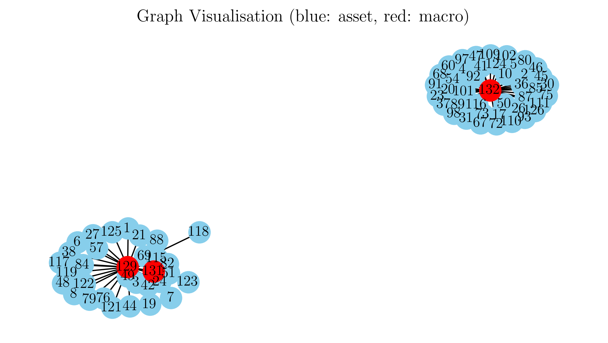
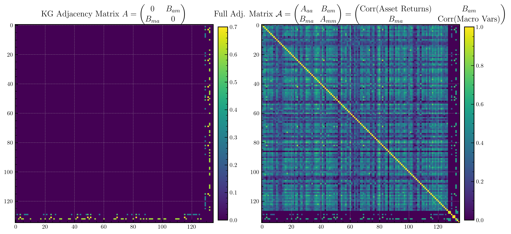
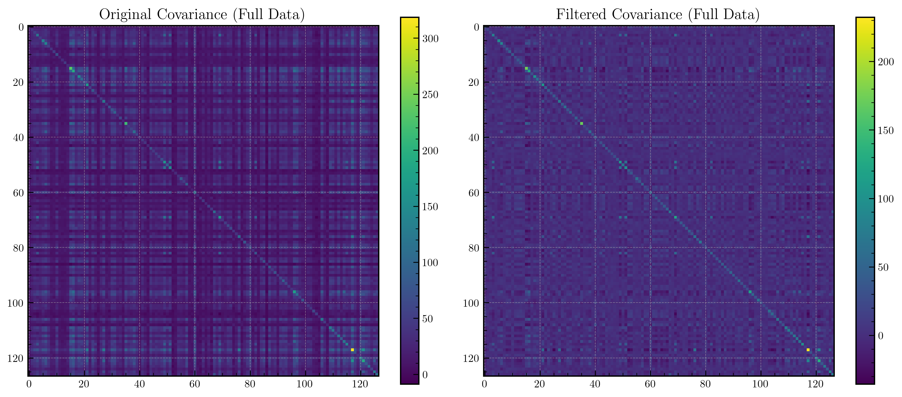
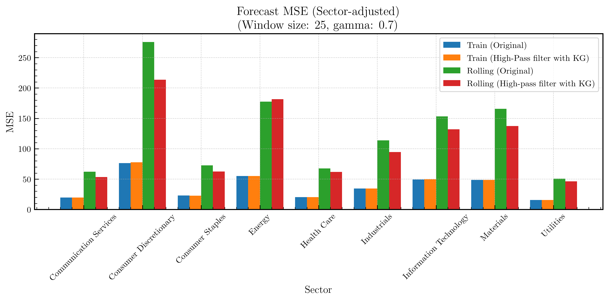
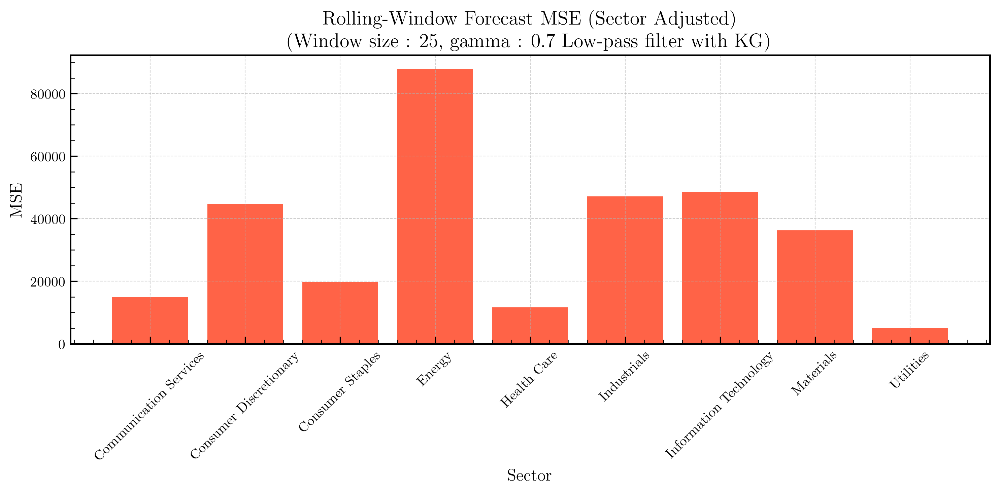

# Modelling Discretionary Views within Knowledge Graphs for Return Prediction

*Timothy Chung, Anthony Bolton*

### Knowledge Graphs (KGs)
Knowledge graphs structure information as a set of triples: `(Entity, Relationship, Entity)` that describe causal or associative relations between entities. In the industry, they are used to integrate qualitative domain knowledge into a more structured form for information retrieval purposes. 

### Graph Signal Processing (GSP)
Graph Signal Processing has historically been used to employ background of signal generating mechanisms to define a graph as a signal domain. This allows for certain analytical techniques which can incorporate signal similarity and spatial locality.

### Challenges in Finance
Portfolio Managers (PMs), especially those in discretionary or macro buy-side roles often rely on predictive models using conventional, structured time-series data e.g. economic indicators, market prices, yield curves, etc. These models are not relied on solely for trading– at times, portfolio managers may wish to influence model predictions especially in times of sudden market events. 

In a sudden market event, the correlations between the feature (input) variables will shift greatly. For example,, during a crisis or a panic sell-off, almost all securities will move together downwards, or the returns of certain securities become very sensitive to certain macroeconomic variables like interest rates. It may be helpful for PMs to have a mechanism to quickly integrate their views on causal relationships partially in such a way that is open for adjustment, as it is often the case that these causal changes are often intermittent.

Modelling covariances between multiple responses is often an uncharted problem in finance, especially when in most modelling cases, the correlations between features are assumed to be constant. [^1].

## Problem Statement

Let $\mathbf{r}_t \in \mathbb{R}^N$ denote the vector of asset returns at time $t$ (for $N$ assets), and $\mathbf{m}_t \in \mathbb{R}^M$ denote a vector of macroeconomic indicators (for $M$ indicators). Our goal is to predict next-period asset returns $\mathbf{r}_{t+1}$ by incorporating both historical asset data and macroeconomic variables, while allowing the portfolio manager (PM) to inject domain knowledge into the model.

Crucially, we encode this domain knowledge in the form of a **heterogeneous knowledge graph** (KG). To simplify the problem, we only consider the class of **asset–macro** relationships (and not asset–asset or macro–macro) views as specified by the PM. These views reflect the PM's beliefs about how sensitive certain asset sectors are to macroeconomic indicators. We use the knowledge graph to construct a block adjacency matrix, which is then used to filter the asset returns via **Graph Fourier Transform (GFT)**. The filtered asset returns are then used to predict future returns, with improved performance. Subsequently, we discuss how we can extend our findings to (asset-asset) and (macro-macro) relationships as well.

## Methodology
To emulate a real-world scenario in a simple form, we apply the use of knowledge graphs to a dataset of US equities' returns and macroeconomic indicators, to predict future returns. 

We use monthly data from 2001-01 to 2023-12 from the following sources:

#### Macroeconomic Indicators $\mathbf{M} \in \mathbb{R}^{M \times T}$

 **Unemployment** and **WorkingAgePop** are obtained from [The Bureau of Labor Statistics](https://data.bls.gov/), and the rest from [fred.stlouisfed.org](https://fred.stlouisfed.org).

- **AAA10Y**: Moody's Seasoned Aaa Corporate Bond Yield (10-year).
- **BAA10Y**: Moody's Seasoned Baa Corporate Bond Yield (10-year).
- **GS10**: 10-Year Treasury Constant Maturity Rate.
- **T10Y3M**: Term spread (10Y minus 3M).
- **IR_10Y_GOV**: OECD long-term government bond yield.
- **CPI**: Consumer Price Index (inflation).
- **Unemployment**: US Unemployment rate.
- **WorkingAgePop**: Working-age population (15–64).

We represent the data as $\mathbf{M} \in \mathbb{R}^{M \times T}$, where $M=8$ is the number of macroeconomic indicators and $T=276$ is the number of time periods.

#### Asset Returns $\mathbf{R} \in \mathbb{R}^{N \times T}$

  Monthly stock-level return data sourced from WRDS/Compustat, accompanied with sector data (e.g. Energy, Materials). Since we are regressing against returns, we have $\mathbf{R} \in \mathbb{R}^{N \times T}$, where $N=127$ is the number of assets and $T=276$ is the number of time periods.

### Stacking Asset Returns and Macroeconomic Indicators
We stack the matrices for asset returns and macroeconomic indicators into a single block matrix:

$$
\mathbf{X} = \begin{bmatrix} \mathbf{R} \\ \mathbf{M} \end{bmatrix} \in \mathbb{R}^{(N+M) \times T}
$$

## Knowledge Graph Construction
We construct a knowledge graph to represent the PM's beliefs about the relationships between asset sectors and macroeconomic indicators. This can be viewed as the matrix $\mathbf{A} \in \mathbb{R}^{(N+M) \times (N+M)}$:

$$
\mathbf{A} =
\begin{bmatrix}
\mathbf{0} & \mathbf{B}_{am} \\
\mathbf{B}_{ma} & \mathbf{0}
\end{bmatrix}
$$
where $\mathbf{B}_{ma} = \mathbf{B}_{am}^\top$.

The upper right block and lower left blocks of $\mathbf{A}$ can be non-zero, which represent the relationships between asset returns and macroeconomic indicators, based on the stacked matrix $\mathbf{X}$. The PM specifies the weights in the knowledge graph.

For example, if the PM believes the asset `HONEYWELL` is correlated (sensitive) to `CPI` with value $b$, this is equivalent constructing a simple knowledge graph with the triple `(HONEYWELL, CPI, b)`.

```
(HONEYWELL)----[b]----(CPI)
```

This can be encoded by a non-zero entry $b$ in $\mathbf{A}$ (specifically in the $\mathbf{B}_{am}$ block), with a row index matching `HONEYWELL` and a column index matching `CPI`, and another matching non-zero entry $b$ symmetrically placed in the $\mathbf{B}_{ma}$ block. 

Examples will be discussed in later sections.


## Block Adjacency Matrix

We build a block adjacency matrix $\mathcal{A} \in \mathbb{R}^{(N+M) \times (N+M)}$ to represent a graph which consists of correlation matrices augmented with the knowledge graph:

$$
\mathcal{A} =
\begin{bmatrix}
\mathbf{A}_{aa} & \mathbf{B}_{am} \\
\mathbf{B}_{ma} & \mathbf{A}_{mm}
\end{bmatrix} = 
\begin{bmatrix}
\text{Corr}(\mathbf{R}) & \mathbf{B}_{am} \\
\mathbf{B}_{ma} & \text{Corr}(\mathbf{M})
\end{bmatrix}
$$

where:


 - $\mathbf{A}_{aa} \in \mathbb{R}^{N\times N}$: Asset–asset similarity matrix, computed as $\text{Corr}(\text{Asset Returns})$ or $\text{Corr}(\mathbf{R})$.
 - $\mathbf{A}_{mm} \in \mathbb{R}^{M\times M}$: Macro–macro similarity matrix, computed as $\text{Corr}(\text{Macro Variables})$ or $\text{Corr}(\mathbf{M})$.
 - $\mathbf{B}_{am} \in \mathbb{R}^{N\times M}$: **PM-specified asset–macro causal weights** (e.g. sector sensitivities).


The elements of $\mathbf{B}_{am}$ (strength of the asset–macro relationships) range betwen $[-1, 1]$, in order to follow the scale of the correlation matrices.


**Important**: Only $\mathbf{B}_{am}$ is directly specified by the PM. All other blocks are computed empirically. 

### Combined Signal Vector

We combine the asset returns and macro indicators into one vector:
$$
\mathbf{x}_t = \begin{bmatrix} \mathbf{r}_t \\ \mathbf{m}_t \end{bmatrix} \in \mathbb{R}^{N+M}
$$

This vector represents the full state of the market at time $t$.

### Graph Filtering via the Laplacian

For our block adjacency matrix $\mathcal{A} =\begin{bmatrix}\mathbf{A}_{aa} & \mathbf{B}_{am} \\\mathbf{B}_{ma} & \mathbf{A}_{mm}\end{bmatrix}$, compute the degree matrix $\mathcal{D}$ with diagonal entries
$$
\mathcal{D}_{ii} = \sum_{j=1}^{N+M} \mathcal{A}_{ij}
$$

Then, the Normalised Laplacian is given by:
$$
\mathcal{L}_{\text{norm}} = \mathcal{I} - \mathcal{D}^{-1/2} \mathcal{A} \mathcal{D}^{-1/2}
$$

Perform an eigen-decomposition of $\mathcal{L}_{\text{norm}}$:
$$
\mathcal{L}_{\text{norm}} = \mathcal{U} \Lambda \mathcal{U}^\top
$$
where $\mathcal{U} \in \mathbb{R}^{(N+M)\times (N+M)}$ is an orthonormal matrix of eigenvectors and $\Lambda = \operatorname{diag}(\lambda_1,\ldots,\lambda_{N+M})$ contains the eigenvalues.

Apply the **Graph Fourier Transform (GFT)** to $\mathbf{x}_t$:
$$
\tilde{\mathbf{x}}_t = \mathcal{U}^\top \mathbf{x}_t
$$

Next, define a spectral filter function $h(\lambda)$. We use an exponential high-pass filter.
$$
h(\lambda) = 1- \exp(-\gamma\, \lambda), \quad \gamma > 0
$$


Then, the filtered spectral coefficients are:
$$
\tilde{\mathbf{x}}_t^{\text{filtered}}(i) = h(\lambda_i) \, \tilde{\mathbf{x}}_t(i)
$$

Finally, recover the filtered signal by inverting the transform:
$$
\mathbf{x}_t^{\text{filtered}} = \mathcal{U}\, \tilde{\mathbf{x}}_t^{\text{filtered}}
$$

Because $\mathbf{x}_t$ stacks both $\mathbf{r}_t$ and $\mathbf{m}_t$, the influence of the macro indicators is now propagated into the filtered asset signals. In particular, let:
$$
\mathbf{r}_t^{\text{filtered}} = \left[\mathbf{x}_t^{\text{filtered}}\right]_{1:N}
$$
which denotes the first $N$ entries corresponding to the assets. In other words, we remove the macro components from the filtered signal, because we are only interested in predicting the asset returns. 


<!-- ## Prediction Model

We propose a simple prediction model where the filtered asset returns drive the next timestep’s returns. For example, a linear autoregressive model may be used:

$$
\mathbf{r}_{t+1} = \boldsymbol{\alpha} + \boldsymbol{\beta}\, \mathbf{r}_t^{\text{filtered}} + \boldsymbol{\epsilon}_t
$$
where $\boldsymbol{\alpha} \in \mathbb{R}^N$, $\boldsymbol{\beta} \in \mathbb{R}^{N\times N}$ are parameters and $\boldsymbol{\epsilon}_t$ is an error term.

The main idea is that $\mathbf{r}_t^{\text{filtered}}$ incorporates the effects of both asset–asset relationships and the PM’s external views (via $\mathbf{B}_{am}$). Thus, by adjusting $\mathbf{B}_{am}$, the PM can express views such as “asset $i$ is more sensitive to macro factor $j$” which in turn affects the filtering and the final prediction. -->


## Prediction Model

Let $\mathbf{r}_t \in \mathbb{R}^N$ denote the asset returns at time $t$, and let $\mathbf{r}_t^{\text{filtered}}\in \mathbb{R}^N$ be the filtered returns obtained via spectral filtering of the combined asset–macro signal $\mathbf{x}_t$. We model the one-step-ahead return as a VAR(1) linear autoregression model:

$$
\mathbf{r}_{t+1} = \boldsymbol{\alpha} + \boldsymbol{\beta}\, \mathbf{r}_t^{\text{filtered}} + \boldsymbol{\epsilon}_t
$$

where:
- $\mathbf{r}_t^{\text{filtered}}$ is the filtered signal,
- $\boldsymbol{\alpha} \in \mathbb{R}^N$, $\boldsymbol{\beta} \in \mathbb{R}^{N \times N}$ are parameters fit via ordinary least squares,
- $\boldsymbol{\epsilon}_t \sim \mathcal{N}(0, \boldsymbol{\Sigma})$ is the residual.

### Online Rolling-Window Forecasting

To evaluate out-of-sample performance, we use a rolling-window scheme with fixed window size $w$:

1. For each $t \in \{w, \ldots, T-2\}$, fit the filtered data $\{\mathbf{r}_{t-w+1}^{(\text{filtered})}, \ldots, \mathbf{r}_{t-1}^{\text{filtered}}\}$ on targets $\{\mathbf{r}_{t-w+2}, \ldots, \mathbf{r}_{t}\}$.
2. Predict $\hat{\mathbf{r}}_{t+1} = \hat{\boldsymbol{\alpha}}_t + \hat{\boldsymbol{\beta}}_t\, \mathbf{r}_t^{\text{filtered}}$.
3. Aggregate forecast errors $\mathbf{r}_{t+1} - \hat{\mathbf{r}}_{t+1}$ over all windows to compute:

- Mean Squared Error (MSE):  
$$
\text{MSE} = \frac{1}{T-w-1} \sum_{t=w}^{T-2} \left\| \mathbf{r}_{t+1} - \hat{\mathbf{r}}_{t+1} \right\|_2^2
$$

- Directional Accuracy (DA):  
$$
\text{DA} = \frac{1}{N(T-w-1)} \sum_{t=w}^{T-2} \sum_{i=1}^N \mathbf{1}\left\{ \operatorname{sign}(\hat{\mathbf{r}}_{t+1,i}) = \operatorname{sign}(\mathbf{r}_{t+1,i}) \right\}
$$

This process is repeated for both raw and filtered returns to assess the impact of incorporating the PM's knowledge via the graph.


## Toy Example

To build intuition, consider a toy example with $N=2$ assets and $M=1$ macro indicator.

Let

$$
\mathbf{A}_{aa} =
\begin{bmatrix}
a_{11} & a_{12} \\
a_{12} & a_{22}
\end{bmatrix}, \quad
\mathbf{A}_{mm} = \begin{bmatrix} a_{mm} \end{bmatrix}, \quad
\mathbf{B}_{am} = \begin{bmatrix} b_1 \\ b_2 \end{bmatrix}, \quad
\mathbf{B}_{ma} = \mathbf{B}_{am}^\top
$$

where $\mathbf{A}_{aa} = \text{Cov}(\text{Asset Returns})$, and $\mathbf{A}_{mm} = \text{Cov}(\text{Macro Variables})$.

The knowledge graph adjacency matrix specified by the PM is sparse and symmetric, containing only asset–macro relationships. For example, in the toy case with two assets and one macro indicator, the PM's adjacency matrix is:

$$
\mathbf{A} = \begin{bmatrix} 0 & 0 & b_1 \\ 0 & 0 & b_2 \\ b_1 & b_2 & 0 \end{bmatrix}
$$

Where $b_1 \in [-1,1]$ measures how much Asset 1 is influenced by the macro indicator $a_{mm}$, and $b_2 \in [-1,1]$ measures how much Asset 2 is influenced by the macro indicator $a_{mm}$. 

Then the full adjacency matrix is:

$$
\mathcal{A} =
\begin{bmatrix}
a_{11} & a_{12} & b_1 \\
a_{12} & a_{22} & b_2 \\
b_1 & b_2 & a_{mm}
\end{bmatrix}
$$

From here, compute:

- Degree matrix $\mathcal{D}$: sum over rows.
- Normalised Laplacian $\mathcal{L}_{\text{norm}} = \mathcal{I} - \mathcal{D}^{-1/2} \mathcal{A} \mathcal{D}^{-1/2}$.
- Eigen-decomposition $\mathcal{L}_{\text{norm}} = \mathcal{U} \Lambda \mathcal{U}^\top$.
- Stack $\mathbf{x}_t = (r_{1,t}, r_{2,t}, m_t)^\top$, apply GFT and filtering as before.

Then extract $\mathbf{r}_t^{\text{filtered}}$ from the first two components. The filtered signal is readily interpretable as a linear combination of the original signal, with the PM's beliefs encoded in the knowledge graph, which is then used to predict future returns.


## Testing the Model

We encode a sensible set of PM’s qualitative beliefs at the **sector level**. For example:

| Sector      | Macro Linkages              |
| ----------- | --------------------------- |
| Energy      | `IR_10Y_GOV`: 0.7,
|              | `CPI`: 0.5 |
| Materials   | `CPI`: 0.3                    |
| Industrials | `T10Y3M`: 0.6                 |

So all securities in the Energy sector are linked to `IR_10Y_GOV` and `CPI` with weights 0.7 and 0.5 respectively. Similarly, all Materials stocks are linked to `CPI` with weight 0.3, and Industrials to `T10Y3M` with weight 0.6.

This will give a knowledge graph as shown:

{ width=65% }

Example triples in the form `(Asset, Asset, Correlation)` could include: 

- `(HONEYWELL, T10Y3M, 0.6)`
- `(HESS CORPORATION, IR_10Y_GOV, 0.7)`
- `(HESS CORPORATION, CPI, 0.5)`
- `(AIR PRODUCTS & CHEMICALS, CPI, 0.3)`
- ...

A knowledge graph is convenient for a portfolio manager to link causal relationships between asset sectors and macroeconomic indicators. There exist many tools to build and visualise knowledge graphs, such as [Neo4j](https://neo4j.com/) and [WhyHow.AI](https://www.whyhow.ai/).

The knowledge graph only has asset–macro relationships, and will occupy the upper right and bottom left blocks of the knowledge graph adjacency matrix $A$. These blocks, $\mathbf{B}_{am}$ and  $\mathbf{B}_{ma}$ assign weights from the assets to macro variables. This will then be augmented with the empirical asset–asset and macro–macro correlation matrices, to form the full adjacency matrix $\mathcal{A}$.

{.center}

The full adjacent matrix is converted into a graph Laplacian, and the GFT is applied to the combined signal vector $\mathbf{x}_t$ to obtain the filtered asset returns $\mathbf{r}_t^{\text{filtered}}$.

The filtered asset returns have a different covariance structure than the raw returns, as shown here:

{.center}


## Results and Discussion

Three instances of the model were tested for 276 months of data from 2001-01 to 2023-12, with a rolling window of 25 months and $\gamma=0.01$. The results are shown below:

| Setup                          | MSE             | Directional Accuracy |
|--------------------------------|-----------------|----------------------|
| Without KG (control)           | 121.36          | 49.86%               |
| With KG, high-pass filter      | 103.20          | 52.64%               |
| With KG, low-pass filter       | 36090.00        | 48.41%               |

With the high-pass filter, the model with KG and high-pass filter achieves the benchmark directional accuracy above 50%. The high-pass filter with KG always outperformed the control for the window sizes $[15,20,25,30]$ and values of $\gamma$ between $0.01$ and $2.0$, with directional accuracy close to around 51-52.5%. This illustrates the robustness of the model and the ease of tuning the parameters for performance.

Recall the definition of the high-pass filter:
$$
h(\lambda) = 1- \exp(-\gamma\, \lambda), \quad \gamma > 0
$$


We use a high-pass graph filter as we believe high-frequency components in the graph spectrum are more likely to capture idiosyncratic deviations– sharper, more responsive relationships between assets and macro signals. Since the PM’s specified asset–macro linkages are sparse and intentional (updated to react to market events), these relationships may express themselves more distinctly in the higher eigenmodes of the Laplacian. A high-pass filter will emphasise these features, which might be more informative for forecasting compared to the smoother patterns retained by low-pass filtering. We found that the high-pass filter improved the model's predictive performance, while the low-pass filter worsened the results.

#### MSE across Sectors

{.center}

Here, we focus more on the Rolling (Original) and Rolling (High-pass) bars, highlighted in red and green. The high-pass filter with KG shows a performance improvement (less MSE) across the industrials and material sectors. It is interesting to note that the MSE increased for the energy sector, which implies that the initial beliefs of the Energy sector being highly sensitive to `IR_10Y_GOV` and `CPI` may not be correct. This is a good example of how the PM can use the model to test their beliefs and adjust them accordingly.

Interestingly, the high-pass graph filter with KG brings performance gains for many other sectors, such as Consumer Discretionary, Consumer Information Technology, among others, **despite the KG not accounting for relationships in these sectors**. It can be posited that graph filtering process not only embeds structural knowledge (even partial or associative) but also stabilises the covariance estimates.

Given the observed performance gains, it is reasonable to argue empirically that the graph-filtered returns yield more robust predictions due to this refinement effect, even in the absence of a fully specified causal model for all sectors.




Here, the low-pass filter blew up the MSE values in all sectors, making it an unsuitable choice for this problem. It is the high-frequency components of the graph spectrum that are more informative for forecasting in this problem.

## Future Work
One natural extension is to allow the PM to specify asset–asset and macro–macro relationships as well. This will then allow for more flexibility in modelling causal relationships. For a very fictional illustrative example: 

> Geopolitical Risk Scenario: Oil Prices $\uparrow$, CPI $\uparrow$, Interest Rates $\uparrow$, Tech Sector Stocks $\downarrow$, but Palantir $\uparrow$

Here, CPI and Interest rates are encoded with an macro-macro relationship, and asset-asset relationships are used to encode the relationship between Palantir and other tech stocks.


 This would require more caution in constructing the full adjacency matrix – as KG adjacency matrix would overlap with the $\mathbf{A}_{aa}$ and $\mathbf{A}_{mm}$ blocks. We can write a KG adjacency matrix that encapsulates all three types of relationships as:

$$
\mathbf{A} =
\begin{bmatrix}
\mathbf{B}_{aa} & \mathbf{B}_{am} \\
\mathbf{B}_{ma} & \mathbf{B}_{mm}
\end{bmatrix}
$$

However, our naive adjacency matrix $\mathcal{A}$ would look like:


$$
\mathcal{A} =
\begin{bmatrix}
\mathbf{A}_{aa}+\mathbf{B}_{aa} & \mathbf{B}_{am} \\
\mathbf{B}_{ma} & \mathbf{A}_{mm}+\mathbf{B}_{aa}
\end{bmatrix} = 
\begin{bmatrix}
\text{Corr}(\mathbf{R})+\mathbf{B}_{aa} & \mathbf{B}_{am} \\
\mathbf{B}_{ma} & \text{Corr}(\mathbf{M})+\mathbf{B}_{mm}
\end{bmatrix}
$$

The scale of the correlation matrices will have increased, with a risk of instability. To address this, it is possible one could take inspiration from Ledoit and Wolf's (2004) [^2] shrinkage estimator for the sample covariance matrix, by scaling the top left and bottom right blocks of the adjacency matrix as such:

$$
\begin{aligned}
\mathcal{A} &=
\begin{bmatrix}
\kappa \mathbf{A}_{aa} + (1-\kappa) \mathbf{B}_{aa} & \mathbf{B}_{am} \\
\mathbf{B}_{ma} & \zeta \mathbf{A}_{mm} + (1-\zeta) \mathbf{B}_{mm}
\end{bmatrix}\\
&=
\begin{bmatrix}
\kappa \text{Corr}(\mathbf{R}) + (1-\kappa) \mathbf{B}_{aa} & \mathbf{B}_{am} \\
\mathbf{B}_{ma} & \zeta \text{Corr}(\mathbf{M}) + (1-\zeta) \mathbf{B}_{mm}
\end{bmatrix}
\end{aligned}
$$

where $\kappa, \zeta \in [0, 1]$ are parameters to be adjusted that control the influence of the KG on the covariance structure. Due to time constraints, we leave this exploration for future work.
 
However, our existing results provide a promising framework for allowing PMs to inject discretionary views into a predictive model as part of their investment process.


---


*Due to the use of external files in the code, the notebook alone is not reproducible when submitted to BlackBoard. All the code and data can be found at the [findata-kg repository](https://github.com/timothycdc/findata-kg/) [https://github.com/timothycdc/findata-kg/](https://github.com/timothycdc/findata-kg/).*

[^1]: Wilson, A. G. and Ghahramani, Z. (n.d.) Modelling Input Varying Correlations between Multiple Responses. Unpublished working paper, University of Cambridge. Accessed 2025. https://mlg.eng.cam.ac.uk/pub/pdf/WilGha12a.pdf

[^2]: Ledoit, O. and Wolf, M. (2020). *The Power of (Non-)Linear Shrinking: A Review and Guide to Covariance Matrix Estimation*. Journal of Financial Econometrics, 18(1), 1–32. https://doi.org/10.1093/jjfinec/nbaa007
