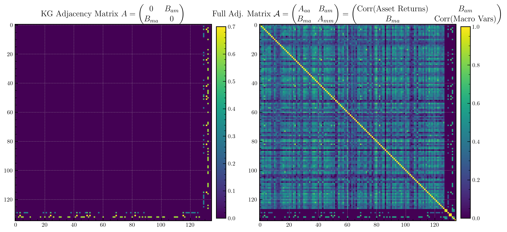
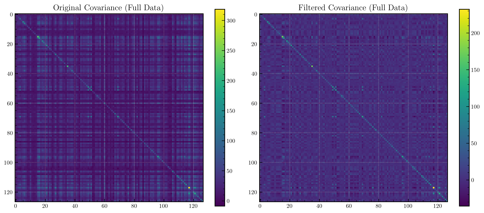

# Incorporating Knowledge Graphs for Return Prediction

*Timothy Chung, Anthony Bolton*

### Knowledge Graphs (KGs)
Knowledge graphs structure information as triples: (Entity, Relationship, Entity) that describe causal or associative relations between entities. In the industry, they are used to integrate qualitative domain knowledge into a more structured form for information retrieval purposes. 

### Graph Signal Processing (GSP)
Graph Signal Processing has historically been used to employ background of signal generating mechanisms to define a graph as a signal domain. This allows for certain analytical techniques which can incorporate signal similarity and spatial locality.

### Challenges in Finance
Portfolio Managers (PMs), especially those in discretionary or macro buy-side roles often rely on predictive models using conventional, structured time-series data e.g. economic indicators, market prices, yield curves, etc. These models are not relied on solely for trading– at times, portfolio managers may override model decisions especially in times of sudden market volatility. 

In a sudden market event, the correlations between the feature (input) variables will shift greatly. E.g., during a crisis or a panic sell-off, almost all securities will move together downwards. It may be helpful for PMs to have a mechanism to quickly integrate their views on causal relationships without retraining the a predictive model, as it is often the case that these causal changes are often intermittent and do not last long enough to warrant a full retraining of the model.

Modelling covariances between multiple responses is often an uncharted problem in finance, especially when in most modelling cases, the correlations between features are assumed to be constant. [^1].

## Problem Statement

Let $r_t \in \mathbb{R}^N$ denote the vector of asset returns at time $t$ (for $N$ assets), and $m_t \in \mathbb{R}^M$ denote a vector of macroeconomic indicators (for $M$ indicators). Our goal is to predict next-period asset returns $r_{t+1}$ by incorporating both historical asset data and macroeconomic variables, while allowing the portfolio manager (PM) to inject domain knowledge into the model.

Crucially, we encode this domain knowledge in the form of a **heterogeneous knowledge graph** (KG), in which only **asset–macro** relationships (and not asset–asset or macro–macro) are specified by the PM. These views reflect the PM's beliefs about how sensitive certain asset sectors are to macroeconomic changes.

## Methodology
To emulate a real-world scenario in a simple form, we apply the use of knowledge graphs to a dataset of US equities' returns and macroeconomic indicators, to predict future returns. 

We use monthly data from 2001-01 to 2023-12 from the following sources:

#### Macroeconomic Indicators $M \in \mathbb{R}^{M \times T}$

 **Unemployment** and **WorkingAgePop** are obtained from [BLS](https://data.bls.gov/), and the rest from [fred.stlouisfed.org](https://fred.stlouisfed.org).

- **AAA10Y**: Moody's Seasoned Aaa Corporate Bond Yield (10-year).
- **BAA10Y**: Moody's Seasoned Baa Corporate Bond Yield (10-year).
- **GS10**: 10-Year Treasury Constant Maturity Rate.
- **T10Y3M**: Term spread (10Y minus 3M).
- **IR_10Y_GOV**: OECD long-term government bond yield.
- **CPI**: Consumer Price Index (inflation).
- **Unemployment**: US Unemployment rate.
- **WorkingAgePop**: Working-age population (15–64).

We represent the data as $M \in \mathbb{R}^{M \times T}$, where $M=8$ is the number of macroeconomic indicators and $T=276$ is the number of time periods.

#### Asset Returns $R \in \mathbb{R}^{N \times T}$

  Monthly stock-level return data sourced from WRDS/Compustat, accompanied with sector data (e.g. Energy, Materials). Since we are regressing against returns, we have $R \in \mathbb{R}^{N \times T}$, where $N=127$ is the number of assets and $T=276$ is the number of time periods.

## Heterogeneous Graph Construction

We build a block adjacency matrix $\mathcal{A} \in \mathbb{R}^{(N+M) \times (N+M)}$ to represent the knowledge graph:

$$
\mathcal{A} =
\begin{bmatrix}
A_{aa} & B_{am} \\
B_{ma} & A_{mm}
\end{bmatrix}
$$

where:

- $A_{aa} \in \mathbb{R}^{N\times N}$: Asset–asset similarity matrix, computed as $\text{Corr}(\text{Asset Returns})$ or $\text{Corr}(R)$.
- $A_{mm} \in \mathbb{R}^{M\times M}$: Macro–macro similarity matrix, computed as $\text{Corr}(\text{Macro Variables})$ or $\text{Corr}(M)$.
- $B_{am} \in \mathbb{R}^{N\times M}$: **PM-specified asset–macro causal weights** (e.g. sector sensitivities).
- $B_{ma} = B_{am}^\top$.

**Important**: Only $B_{am}$ is directly specified by the PM. All other blocks are computed empirically.

For example, if the PM believes the Energy sector is highly sensitive to long-term interest rates and CPI, this is encoded by non-zero entries in $B_{am}$ linking Energy stocks to `IR_10Y_GOV` and `CPI`.

This is then embedded within the full adjacency matrix $\mathcal{A}$, which includes empirical asset–asset and macro–macro blocks to complete the Laplacian construction.

### Combined Signal Vector

We combine the asset returns and macro indicators into one vector:
$$
x_t = \begin{bmatrix} r_t \\ m_t \end{bmatrix} \in \mathbb{R}^{N+M}
$$

This vector represents the full state of the market at time $t$.

### Graph Filtering via the Laplacian

For our block adjacency matrix $\mathcal{A} =\begin{bmatrix}A_{aa} & B_{am} \\B_{ma} & A_{mm}\end{bmatrix}$, compute the degree matrix $\mathcal{D}$ with diagonal entries
$$
\mathcal{D}_{ii} = \sum_{j=1}^{N+M} \mathcal{A}_{ij}
$$

Then, the Laplacian is given by:
$$
\mathcal{L} = \mathcal{D} - \mathcal{A}
$$

Perform an eigen-decomposition of $\mathcal{L}$:
$$
\mathcal{L} = \mathcal{U} \Lambda \mathcal{U}^\top
$$
where $\mathcal{U} \in \mathbb{R}^{(N+M)\times (N+M)}$ is an orthonormal matrix of eigenvectors and $\Lambda = \operatorname{diag}(\lambda_1,\ldots,\lambda_{N+M})$ contains the eigenvalues.

Apply the **Graph Fourier Transform (GFT)** to $x_t$:
$$
\tilde{x}_t = \mathcal{U}^\top x_t
$$

Next, define a spectral filter function $h(\lambda)$. We use an exponential high-pass filter.
$$
h(\lambda) = 1- \exp(-\gamma\, \lambda), \quad \gamma > 0
$$

> We use a high pass filter as we believe high-frequency components in the graph spectrum are more likely to capture idiosyncratic deviations– sharper, more responsive relationships between assets and macro signals. Since the PM’s specified asset–macro linkages are sparse and intentional (updated to react to market events), these relationships may express themselves more distinctly in the higher eigenmodes of the Laplacian. A high-pass filter will emphasise these features, which might be more informative for forecasting compared to the smoother patterns retained by low-pass filtering. We tested the GFT with a high-pass filter and found it to improve the model's predictive performance, while the low-pass filter worsened the results.

Then, the filtered spectral coefficients are:
$$
\tilde{x}_t^{\text{filtered}}(i) = h(\lambda_i) \, \tilde{x}_t(i)
$$

Finally, recover the filtered signal by inverting the transform:
$$
x_t^{\text{filtered}} = \mathcal{U}\, \tilde{x}_t^{\text{filtered}}
$$

Because $x_t$ stacks both $r_t$ and $m_t$, the influence of the macro indicators is now propagated into the filtered asset signals. In particular, let:
$$
r_t^{\text{filtered}} = \left[x_t^{\text{filtered}}\right]_{1:N}
$$
which denotes the first $N$ entries corresponding to the assets. In other words, we remove the macro components from the filtered signal, because we are only interested in predicting the asset returns. 

<!-- ## Prediction Model

We propose a simple prediction model where the filtered asset returns drive the next timestep’s returns. For example, a linear autoregressive model may be used:

$$
r_{t+1} = \alpha + \beta\, r_t^{\text{filtered}} + \epsilon_t
$$
where $\alpha \in \mathbb{R}^N$, $\beta \in \mathbb{R}^{N\times N}$ are parameters and $\epsilon_t$ is an error term.

The main idea is that $r_t^{\text{filtered}}$ incorporates the effects of both asset–asset relationships and the PM’s external views (via $B_{am}$). Thus, by adjusting $B_{am}$, the PM can express views such as “asset $i$ is more sensitive to macro factor $j$” which in turn affects the filtering and the final prediction. -->

## Prediction Model

Let $r_t \in \mathbb{R}^N$ denote the asset returns at time $t$, and let $r_t^{\text{filtered}}$ be the filtered returns obtained via spectral filtering of the combined asset–macro signal $x_t$. We model the one-step-ahead return as a AR(1) linear autoregression model:

$$
r_{t+1} = \alpha + \beta\, r_t^{\text{filtered}} + \epsilon_t,
$$
where:
- $r_t^{\text{filtered}}$ is the filtered signal,
- $\alpha \in \mathbb{R}^N$, $\beta \in \mathbb{R}^{N \times N}$ are parameters fit via ordinary least squares,
- $\epsilon_t \sim \mathcal{N}(0, \Sigma)$ is the residual.

### Online Rolling-Window Forecasting

To evaluate out-of-sample performance, we use a rolling-window scheme with fixed window size $w$:

1. For each $t \in \{w, \ldots, T-2\}$, fit the filtered data $\{r_{t-w+1}^{(\text{filtered})}, \ldots, r_{t-1}^{\text{filtered}}\}$ on targets $\{r_{t-w+2}, \ldots, r_{t}\}$.
2. Predict $\hat{r}_{t+1} = \hat{\alpha}_t + \hat{\beta}_t\, r_t^{\text{filtered}}$.
3. Aggregate forecast errors $r_{t+1} - \hat{r}_{t+1}$ over all windows to compute:

- Mean Squared Error (MSE):  
$$
\text{MSE} = \frac{1}{T-w-1} \sum_{t=w}^{T-2} \left\| r_{t+1} - \hat{r}_{t+1} \right\|_2^2
$$

- Directional Accuracy (DA):  
$$
\text{DA} = \frac{1}{N(T-w-1)} \sum_{t=w}^{T-2} \sum_{i=1}^N \mathbf{1}\left\{ \operatorname{sign}(\hat{r}_{t+1,i}) = \operatorname{sign}(r_{t+1,i}) \right\}
$$

This process is repeated for both raw and filtered returns to assess the impact of incorporating the PM’s knowledge via the graph.

## Toy Example

To build intuition, consider a toy example with $N=2$ assets and $M=1$ macro indicator.

Let

$$
A_{aa} =
\begin{bmatrix}
a_{11} & a_{12} \\
a_{12} & a_{22}
\end{bmatrix}, \quad
A_{mm} = \begin{bmatrix} a_{mm} \end{bmatrix}, \quad
B_{am} = \begin{bmatrix} b_1 \\ b_2 \end{bmatrix}, \quad
B_{ma} = B_{am}^\top
$$

where $A_{aa} = \text{Cov}(\text{Asset Returns})$, and $A_{mm} = \text{Cov}(\text{Macro Variables})$.

The knowledge graph adjacency matrix specified by the PM is sparse and symmetric, containing only asset–macro relationships. For example, in the toy case with two assets and one macro indicator, the PM’s adjacency matrix is:

$$
A = \begin{bmatrix} 0 & 0 & b_1 \\ 0 & 0 & b_2 \\ b_1 & b_2 & 0 \end{bmatrix}
$$

Then the full adjacency matrix is:

$$
\mathcal{A} =
\begin{bmatrix}
a_{11} & a_{12} & b_1 \\
a_{12} & a_{22} & b_2 \\
b_1 & b_2 & a_{mm}
\end{bmatrix}
$$

From here, compute:

- Degree matrix $\mathcal{D}$: sum over rows.
- Laplacian $\mathcal{L} = \mathcal{D} - \mathcal{A}$.
- Eigen-decomposition $\mathcal{L} = \mathcal{U}\Lambda\mathcal{U}^\top$.
- Stack $x_t = (r_{1,t}, r_{2,t}, m_t)^\top$, apply GFT and filtering as before.

Then extract $r_t^{\text{filtered}}$ from the first two components.

## Testing the Model

We encode a sensible set of PM’s beliefs at the **sector level**. For example:

| Sector      | Macro Linkages              |
| ----------- | --------------------------- |
| Energy      | `IR_10Y_GOV`: 0.7,
|              | `CPI`: 0.5 |
| Materials   | `CPI`: 0.3                    |
| Industrials | `T10Y3M`: 0.6                 |

So all securities in the Energy sector are linked to `IR_10Y_GOV` and `CPI` with weights 0.7 and 0.5 respectively. Similarly, all Materials stocks are linked to `CPI` with weight 0.3, and Industrials to `T10Y3M` with weight 0.6.

This will give a knowledge graph as shown:

A knowledge graph is convenient for a portfolio manager to link causal relationships between asset sectors and macroeconomic indicators. There exist many tools to build and visualise knowledge graphs, such as [Neo4j](https://neo4j.com/) and [WhyHow.AI](https://www.whyhow.ai/).

The knowledge graph only has asset–macro relationships, and will occupy the upper right and bottom left blocks of the adjacency matrix. This will then be augmented with the empirical asset–asset and macro–macro correlation matrices.

The full adjacent matrix is converted into a graph Laplacian, and the GFT is applied to the combined signal vector $x_t$ to obtain the filtered asset returns $r_t^{\text{filtered}}$.

The filtered asset returns have a different covariance structure than the raw returns, as shown here:

This is translated into the $B_{am}$ block of the adjacency matrix by assigning weights from the sector to macro variables. Asset-level linking is also possible, but this will be left for future work.

## Results and Discussion
| Setup                          | MSE             | Directional Accuracy |
|--------------------------------|-----------------|----------------------|
| Without KG, high-pass filter   | 121.36          | 49.86%               |
| With KG, high-pass filter      | 103.33          | 52.48%               |
| With KG, low-pass filter       | 36090.00        | 48.41%               |

We use a high pass filter as we believe high-frequency components in the graph spectrum are more likely to capture idiosyncratic deviations– sharper, more responsive relationships between assets and macro signals. Since the PM’s specified asset–macro linkages are sparse and intentional (updated to react to market events), these relationships may express themselves more distinctly in the higher eigenmodes of the Laplacian. A high-pass filter will emphasise these features, which might be more informative for forecasting compared to the smoother patterns retained by low-pass filtering. We tested the GFT with a high-pass filter and found it to improve the model's predictive performance, while the low-pass filter worsened the results.

## Future Work
One natural extension is to allow the PM to specify asset–asset and macro–macro relationships as well. This will then allow for more flexibility in modelling causal relationships. For a very fictional illustrative example: 

> Geopolitical Risk Scenario: Oil Prices $\uparrow$, CPI $\uparrow$, Interest Rates $\uparrow$, Tech Sector Stocks $\downarrow$, but Palantir $\uparrow$

 This would require a more care in constructing the full adjacency matrix – as KG adjacency matrix would overlap with the $A_{aa}$ and $A_{mm}$ blocks. However, this is a promising framework for allowing PMs to inject their views into a predictive model.

[^1]: Wilson, A. G. and Ghahramani, Z. (n.d.) Modelling Input Varying Correlations between Multiple Responses. Unpublished working paper, University of Cambridge. Accessed 2025. https://mlg.eng.cam.ac.uk/pub/pdf/WilGha12a.pdf
